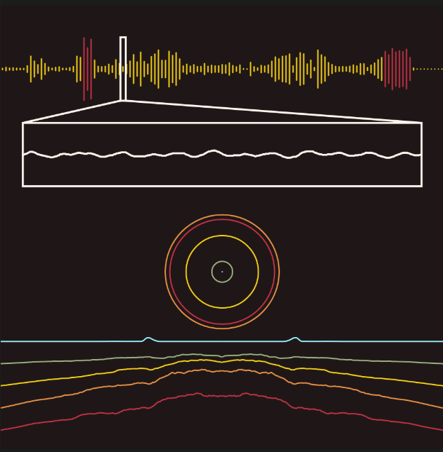

# :musical_note: Music Visualization
- Song **intensity** timeline.
- Current raw **soundwave** drawing.
- **Frequency decompositon** using *Fourier Transform*.
- Frequency volume visualization with **colors**, **lines** and **circles**.

## Sample

